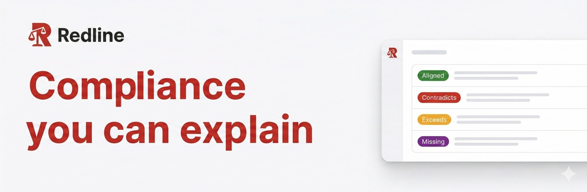

# Redline - Mistral AI Worldwide Hackathon 2026 (Paris)

## What does our project do?
Redline is an **explainable compliance engine** that automates HR policy verification against California and US federal labor rules. Instead of black-box generation, Redline builds a sophisticated and transparent system tailored for legal professionals:

- **Technicality:** Uses a fine-tuned Mistral model to extract structured decision logic from unstructured policies, coupled with a deterministic rule comparison engine for bulletproof accuracy. We've built an autonomous self-improvement loop using **Weights & Biases** to evaluate and optimize the extraction schema, and optimized our local engine for **Nvidia** hardware.
- **Usefulness:** Drastically reduces the time lawyers spend reviewing long HR handbooks by flagging specific jurisdictional conflicts, allowing them to focus on high-level legal strategy rather than manual reading.
- **Creativity:** Combines probabilistic extraction with deterministic checking, creating a novel hybrid architecture where the AI structures data, and code verifies compliance.

## Demo Video
[Watch our Demo Video Here](<INSERT_LOOM_LINK>)

## Technical Architecture

### How the core engine works
1. **Extraction:** A user uploads a policy PDF or text. A fine-tuned Mistral model extracts the implicit HR rules into a strictly typed JSON decision schema.
2. **Comparison:** This structured payload is deterministically compared against our database of California and Federal legislation JSON rules. 
3. **Review:** A compliance report is generated. Lawyers review the AI's extraction, and can accept, deny, or edit the rules in our UI.

### Continuous Fine-tuning Pipeline
The true power of Redline comes from its data flywheel. Every time a lawyer edits or corrects a rule extraction in the UI, that delta is captured. When the error threshold is met, the pipeline is automatically re-triggered to fine-tune our Mistral model on the corrected data, constantly improving our foundational extraction capabilities.

### Weights & Biases: Automated Evals & Optimization
We rely on the **W&B MCP Server** and agentic workflows to drive our optimization loop. A coding agent iteratively evaluates the model's extraction accuracy using W&B Weave, inspects failure modes, and automatically adjusts the prompt schema and config. 

**Model Evaluation & Improvements**
*Baseline vs Fine-tuned F1 Score: [View W&B Report](<INSERT_WANDB_REPORT_LINK>)*
*(Placeholder: Insert screenshot/graph of W&B accuracy improvement here)*

*(Placeholder: Insert text detailing specific metric lifts, e.g., "Our automated agent optimized the schema to improve overtime extraction accuracy by 14% over 3 iterations.")*

### Nvidia: On-Device Deployment
We target local and edge deployments using **Nvidia** optimizations. Legal and HR data is highly sensitive. By utilizing hardware acceleration (e.g., TensorRT-LLM), the Redline extraction engine can run entirely on-device, ensuring zero data leakage to external APIs while maintaining the low-latency required for a responsive UI.

## Develop locally

**Prerequisites:** Node.js 20+, Bun 1.1+, Python 3.12+, `uv`

**1. Install dependencies:**
```bash
bun install
cd backend && uv sync && cd ..
```

**2. Run services (in separate terminals):**
```bash
bun run dev:frontend
bun run dev:backend
```

## Scope and Legal Disclaimer
Redline assists with policy extraction and rule comparison. It does not provide legal advice. Final determinations must be reviewed by qualified legal professionals.
